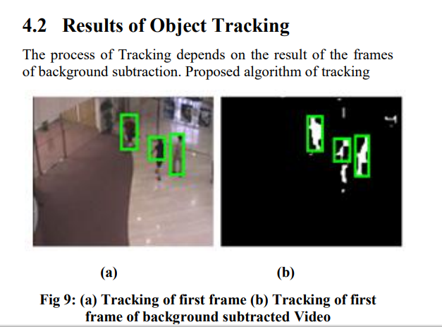

# 论文阅读

## 前三年：

### （2012）1、Object Detection and Tracking using Background Subtraction and Connected Component Labeling

#### 使用背景减法与连通区域标记进行目标检测和跟踪

#### 由来：百度搜索连通区域计数的病斑检测查阅文章

#### 概要：该论文是2012年的，是将视频的上下帧相减，得到最大变化的像素点，即为感兴趣区域，将这个区域分割出来后，采用连停区域标记算法进行画框跟踪并计数

#### 收获：

#### 专有名词：connected component labeling 连通域标记

## 近三年：

### （2017）1、一种基于连通标记的纸病检测算法

